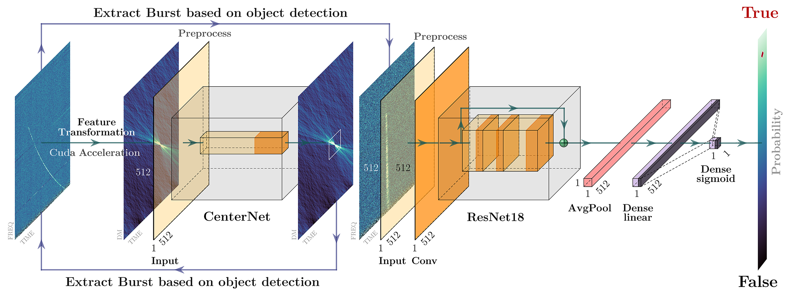

# DRAFTS++: Deep Learning Radio Transient Search

[](https://github.com/Kodamonkey/DRAFTS-UC/releases)
[](https://www.python.org/downloads/)
[](https://pytorch.org/)
[](https://developer.nvidia.com/cuda-toolkit)
[](https://www.docker.com/)
[](LICENSE)
[](https://arxiv.org/abs/2410.03200)




*Top: low-frequency / general (LF) pipeline; bottom: high-frequency (≥8 GHz) (HF) — two execution modes.*

## What is DRAFTS++

**DRAFTS++** is a deep-learning pipeline to detect fast radio bursts (FRBs) in radio astronomy data. It has two stages: **CenterNet** localizes candidates in time–DM space from dedispersed dynamic spectra, and **ResNet** classifies them as BURST vs non-BURST (RFI/noise). Input: `.fits` or `.fil` files; output: candidates with DM, time, SNR, and classification probability.

For high-frequency observations (≥8 GHz), the pipeline uses matched-filter detection, frequency integration, and ResNet18 to classify candidates from SNR peaks.

> Based on [DRAFTS](https://github.com/SukiYume/DRAFTS) by Zhang et al. | [Paper](https://arxiv.org/abs/2410.03200)

---

## Project layout and where things go

Always run commands (`python main.py`, Docker) **from the repository root** (where `main.py` and `config.yaml` live). Relative paths in `config.yaml` resolve against that directory.

### Recommended tree (local)

```text
DRAFTS-UC/                    # repo root
├── config.yaml               # main configuration (edit paths and parameters here)
├── main.py
├── Data/
│   └── raw/                  # input data: place your .fits / .fil here (default in config)
│       └── *.fits, *.fil
├── Results/                  # typical output when using Docker (see note below)
│   └── …                     # CSV, plots, logs produced by the pipeline
├── src/
│   └── models/               # network weights (required)
│       ├── cent_resnet18.pth # CenterNet (detection)
│       └── class_resnet18.pth# ResNet (BURST / non-BURST classification)
└── advanced-config/          # optional: fine-tuning (performance, plots, logging)
```

You may use **another folder** for data or results: set the absolute or relative path in `config.yaml` (`data.input_dir`, `data.results_dir`). The input directory **must exist** before you run the pipeline.

### What goes where

| What | Where to put it | How the program is told |
|------|-----------------|-------------------------|
| **Raw data** (`.fits`, `.fil`) | Folder of your choice; default `Data/raw/` | `data.input_dir` in `config.yaml`, e.g. `"./Data/raw/"` or `"D:/astronomy/data/"` |
| **Trained models** | `src/models/` (fixed in code) | Expected names: `cent_resnet18.pth` and `class_resnet18.pth` (defined in `src/config/config.py` for ResNet18) |
| **Outputs** (CSV, figures, logs) | Empty or existing folder; e.g. `Results/` or `ResultsThesis/.../` | `data.results_dir` in `config.yaml` |
| **Which files to process** | No need to move them if they are already in `input_dir` | List `data.targets`: name patterns (substrings that match filenames) |

### Key parameters in `config.yaml`

```yaml
data:
  input_dir: "./Data/raw/"           # folder containing .fits / .fil
  results_dir: "./Results/my_run/"   # everything generated goes here
  targets:
    - "pattern_or_filename"          # one or more patterns
```

- **`input_dir`**: all files to search must be **inside** this directory (the pipeline matches by pattern under that path).
- **`results_dir`**: created/used for tables, plots, and logs; pick a path with space and write permissions.
- **`targets`**: for each entry, files whose name **contains** that text are considered (the full name is not required if the pattern is unique).

### Docker: host ↔ container mapping

`docker-compose.yml` mounts volumes so data is not lost when the container stops:

| On your PC (host) | Inside the container | Purpose |
|-------------------|----------------------|---------|
| Path **you** configure (e.g. `D:/MyData/frb`) | `/app/Data/raw` | Only change the **left** side of the volume: that is where your `.fits` / `.fil` live |
| `./config.yaml` | `/app/config.yaml` | Same configuration; edit it in the repo |
| `./Results` | `/app/Results` | **Persistent** output folder on the host |
| `./src/models` | `/app/src/models` | Weights `cent_resnet18.pth` and `class_resnet18.pth` |

**Important (Docker):** the results volume only covers `/app/Results`. For CSVs and plots to appear in the host `./Results` folder, `data.results_dir` in `config.yaml` must be **under** that path, for example:

```yaml
data:
  input_dir: "./Data/raw/"      # in-container = data mounted at /app/Data/raw
  results_dir: "./Results/my_experiment/"
```

If you set `results_dir` to a path outside `./Results` (e.g. only `./ResultsThesis/` in the container without mounting that folder), files are written **inside the container** and are lost when the container is removed. Align `results_dir` with the volumes you mount (or add another volume in `docker-compose.yml`).

---

## Prerequisites

| Item | Description |
|------|-------------|
| **Models** | `cent_resnet18.pth` and `class_resnet18.pth` in `src/models/` (see table above). |
| **Data** | `.fits` or `.fil` in the folder given by `data.input_dir`. |
| **Python** | **3.10+** recommended (matches the Docker image). |
| **GPU (optional)** | For local CUDA acceleration, install PyTorch with CUDA matching your driver. With Docker, use the `drafts-gpu` service and the [NVIDIA Container Toolkit](https://docs.nvidia.com/datacenter/cloud-native/container-toolkit/install-guide.html). |

Typical `config.yaml` tweaks: `data.input_dir`, `data.results_dir`, `data.targets`, `dm_min` / `dm_max`, detection and classification thresholds. The `advanced-config/` folder holds extra options (performance, visualization, models, logging).

---

## Local execution

### 1. Virtual environment and install

From the repository root:

```bash
python -m venv .venv
```

**Windows (PowerShell):** `.\.venv\Scripts\Activate.ps1`  
**Linux / macOS:** `source .venv/bin/activate`

```bash
pip install -U pip
pip install -r requirements.txt
```

`requirements.txt` includes `torch` and `torchvision` without pinning CPU/CUDA index. For **GPU**, install PyTorch compatible with your CUDA from the [official page](https://pytorch.org/get-started/locally/) (replace or reinstall `torch`/`torchvision` per the installer). Docker images ship PyTorch CPU or CUDA 11.8 depending on the target.

### 2. Paths and configuration

Put data in the folder set in `data.input_dir`, weights in `src/models/`, and review `data.targets` (section **Project layout and where things go** above). The input directory must exist before you run.

### 3. Run the pipeline

```bash
python main.py
```

Optional command-line overrides:

```bash
python main.py --help
python main.py --dm-max 512 --det-prob 0.5 --class-prob 0.4
python main.py --data-dir "C:/path/to/data" --results-dir "./Results" --target "file_pattern"
```

**Note:** `--data-dir` and `--results-dir` apply to local runs. With Docker, prefer fixing paths via volumes in `docker-compose.yml` (next section).

---

## Docker execution

Useful to reproduce the environment without installing system dependencies (CFITSIO, HDF5, etc.) on the host.

### Requirements

- [Docker](https://docs.docker.com/get-docker/) (on Windows, Docker Desktop with Linux backend).
- **GPU only:** NVIDIA drivers + [NVIDIA Container Toolkit](https://docs.nvidia.com/datacenter/cloud-native/container-toolkit/install-guide.html) to use `runtime: nvidia` in `docker-compose.yml`.

### Configure volumes

Edit `docker-compose.yml` and adjust **only the left** side of the data mount: that is the **real** folder on your PC with `.fits` / `.fil`. Do not change the right side `/app/Data/raw`.

```yaml
volumes:
  - /path/on/your/system:/app/Data/raw:ro   # Linux / macOS — example
  # Windows (PowerShell / Docker Desktop): for example
  # - D:/Astronomy/FRB/data:/app/Data/raw:ro
```

In `config.yaml` keep `data.input_dir: "./Data/raw/"` so inside the container it points to that mount (equivalent to `/app/Data/raw`).

Other mounts are in the **Docker: host ↔ container mapping** table above. Models must be in `src/models/` on the host before build or run.

### Build images

From the repository root:

```bash
docker compose build drafts-cpu    # CPU
docker compose build drafts-gpu    # GPU (CUDA 11.8 in Dockerfile)
```

Older installs may use the hyphen: `docker-compose build ...`.

### Run

```bash
docker compose run --rm drafts-cpu
docker compose run --rm drafts-gpu
```

The container default command is `python main.py`. Optional environment variables (e.g. `OMP_NUM_THREADS`, `MKL_NUM_THREADS`, `NUMBA_NUM_THREADS`) and CPU/memory limits can be set in `docker-compose.yml` or host env vars (`DRAFTS_CPU_LIMIT`, `DRAFTS_MEM_LIMIT`, etc.).

**Permissions (Linux):** the service uses `user: "1000:1000"`. If you get permission errors on `./Results`, align UID/GID on those folders with the container user or adjust the value in *compose*.

---

## Outputs

Everything produced (CSV, figures, pipeline logs) goes to `data.results_dir`. Locally it can be any writable path. With Docker, use a subfolder of `./Results` in the repo (mounted at `/app/Results`) so files land on disk; see the warning after the table in **Project layout and where things go**.

---

## Tests (optional)

If you have `pytest` installed:

```bash
pytest src/tests -q
```

---

## Citation

```bibtex
@article{zhang2024drafts,
  title={DRAFTS: A Deep Learning-Based Radio Fast Transient Search Pipeline},
  author={Zhang, Y.-K. and others},
  journal={arXiv preprint arXiv:2410.03200},
  year={2024}
}
```

**DRAFTS++ developer:** Sebastian Salgado Polanco