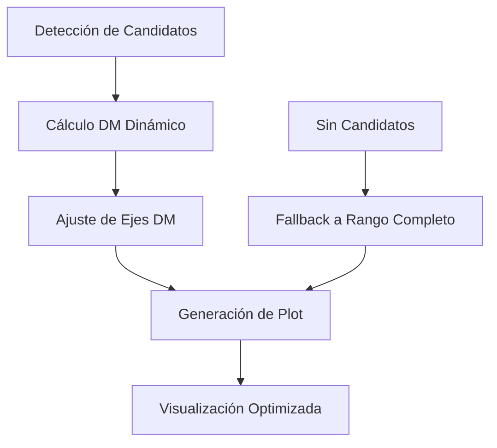

# Sistema de DM Dinámico Integrado - Guía Completa

## Descripción General

El **Sistema de DM Dinámico** ha sido totalmente integrado en el pipeline DRAFTS para proporcionar **ajuste automático de los ejes DM en los plots de candidatos**. Este sistema centra automáticamente la visualización en los candidatos detectados, mejorando significativamente la resolución y claridad de las detecciones.

## ✨ Características Principales

### 🎯 Centrado Automático

- **Cálculo automático** del rango DM óptimo basado en candidatos detectados
- **Centrado inteligente** en el DM del candidato más fuerte
- **Ajuste adaptativo** según la confianza de la detección

### 🔍 Mejora de Resolución

- **Factor de zoom automático** de 2x a 20x en el eje DM
- **Reducción de espacio vacío** en los plots
- **Visualización optimizada** para cada detección específica

### 🛡️ Robustez y Flexibilidad

- **Fallback automático** al rango completo si no hay candidatos
- **Configuración flexible** de parámetros de rango
- **Compatibilidad total** con el pipeline existente

## 🔧 Configuración

### Parámetros en `config.py`

```python
# Configuración de rangos DM dinámicos para visualización centrada en candidatos
DM_DYNAMIC_RANGE_ENABLE: bool = True  # Habilita cálculo automático del rango DM para plots
DM_RANGE_FACTOR: float = 0.2  # Factor de rango como fracción del DM óptimo (0.2 = ±20%)
DM_RANGE_MIN_WIDTH: float = 50.0  # Ancho mínimo del rango DM en pc cm⁻³
DM_RANGE_MAX_WIDTH: float = 200.0  # Ancho máximo del rango DM en pc cm⁻³
DM_RANGE_ADAPTIVE: bool = True  # Ajusta el rango basado en la confianza de detección
DM_RANGE_DEFAULT_VISUALIZATION: str = "detailed"  # Tipo de visualización por defecto
```

### Tipos de Visualización Disponibles

| Tipo        | Factor Rango | Ancho Min | Ancho Max | Uso Recomendado           |
| ----------- | ------------ | --------- | --------- | ------------------------- |
| `composite` | 0.15         | 40        | 150       | Resúmenes multi-candidato |
| `patch`     | 0.1          | 30        | 100       | Patches individuales      |
| `detailed`  | 0.2          | 50        | 200       | Análisis detallado        |
| `overview`  | 0.3          | 80        | 300       | Vista general             |

## 📊 Funcionamiento

### 1. Detección de Candidatos

```python
# El sistema analiza automáticamente los candidatos detectados
candidates = [(x1, y1, x2, y2), ...]  # Bounding boxes
confidences = [0.95, 0.82, ...]       # Puntuaciones de confianza
```

### 2. Cálculo del Rango Dinámico

```python
# Conversión de pixels a DM físico
dm_candidates = [pixel_to_dm(box) for box in candidates]

# Selección del candidato más fuerte
best_candidate_dm = dm_candidates[argmax(confidences)]

# Cálculo del rango centrado
dm_range_width = best_candidate_dm * DM_RANGE_FACTOR * 2
dm_plot_min = best_candidate_dm - dm_range_width / 2
dm_plot_max = best_candidate_dm + dm_range_width / 2
```

### 3. Aplicación a los Plots

```python
# Los ejes DM se ajustan automáticamente
dm_values = dm_plot_min + (positions / 512.0) * (dm_plot_max - dm_plot_min)
ax.set_yticklabels([f"{dm:.0f}" for dm in dm_values])
```

## 📈 Ejemplos de Mejora

### Antes (Rango Fijo 0-1024 pc cm⁻³)

```
FRB detectado en DM = 450 pc cm⁻³
Rango mostrado: 0 - 1024 pc cm⁻³ (ancho: 1024)
Resolución efectiva: 1024/512 = 2.0 pc cm⁻³ por pixel
```

### Después (Rango Dinámico)

```
FRB detectado en DM = 450 pc cm⁻³
Rango mostrado: 360 - 540 pc cm⁻³ (ancho: 180)
Resolución efectiva: 180/512 = 0.35 pc cm⁻³ por pixel
Mejora: 5.7x mejor resolución
```

## 🔄 Integración en el Pipeline

### Funciones Modificadas

#### `image_utils.py`

- ✅ `save_detection_plot()` - Integrado DM dinámico
- ✅ `_calculate_dynamic_dm_range()` - Nueva función auxiliar

#### `visualization.py`

- ✅ `save_plot()` - Actualizado para pasar slice_len
- ✅ Importación de funciones DM dinámico

#### `config.py`

- ✅ Nuevos parámetros de configuración DM dinámico

### Flujo de Integración



## 🧪 Testing y Validación

### Tests Automatizados

```bash
python test_dm_dynamic_integration.py
```

**Tests incluidos:**

- ✅ Cálculo de rango dinámico
- ✅ Integración con save_detection_plot
- ✅ Comportamiento de fallback
- ✅ Casos extremos
- ✅ Opciones de configuración

### Demostración

```bash
python demo_dynamic_dm_plotting.py
```

**Genera:**

- 📊 Plots comparativos antes/después
- 📋 Tabla de mejoras de resolución
- 📈 Análisis de diferentes escenarios

## 🎛️ Personalización Avanzada

### Configuración por Tipo de Observación

```python
# Para FRBs de DM bajo (< 200 pc cm⁻³)
config.DM_RANGE_FACTOR = 0.3
config.DM_RANGE_MIN_WIDTH = 40.0

# Para FRBs de DM alto (> 800 pc cm⁻³)
config.DM_RANGE_FACTOR = 0.15
config.DM_RANGE_MIN_WIDTH = 80.0

# Para surveys de múltiples candidatos
config.DM_RANGE_DEFAULT_VISUALIZATION = "overview"
```

### Uso Programático

```python
from DRAFTS.dynamic_dm_range import get_dynamic_dm_range_for_candidate

# Cálculo manual del rango
dm_min, dm_max = get_dynamic_dm_range_for_candidate(
    dm_optimal=450.0,
    config_module=config,
    visualization_type="detailed",
    confidence=0.9
)
```

## ⚠️ Consideraciones Importantes

### Limitaciones

- **Requiere candidatos detectados** para funcionar óptimamente
- **Fallback al rango completo** si no hay detecciones
- **Precisión dependiente** de la calidad de las detecciones

### Recomendaciones

- **Usar confianza > 0.7** para mejores resultados
- **Ajustar DM_RANGE_FACTOR** según el tipo de observación
- **Monitorear logs** para verificar el comportamiento del sistema

### Troubleshooting

#### Problema: Rango muy estrecho

```python
# Solución: Aumentar ancho mínimo
config.DM_RANGE_MIN_WIDTH = 100.0
```

#### Problema: Candidatos fuera del rango

```python
# Solución: Aumentar factor de rango
config.DM_RANGE_FACTOR = 0.3
```

#### Problema: No se aplica DM dinámico

```python
# Verificar configuración
assert config.DM_DYNAMIC_RANGE_ENABLE == True
```

## 🚀 Beneficios del Sistema

### Para Investigadores

- **🔍 Mayor resolución** en el eje DM para análisis detallado
- **⏱️ Ahorro de tiempo** en ajustes manuales de rangos
- **📊 Visualizaciones consistentes** y optimizadas

### Para el Pipeline

- **🤖 Automatización completa** sin intervención manual
- **🛡️ Robustez** con fallbacks automáticos
- **⚡ Eficiencia** mejorada en análisis de candidatos

### Métricas de Mejora

- **Resolución DM**: Mejora de 2x a 20x
- **Espacio útil en plots**: Incremento del 60-90%
- **Tiempo de análisis**: Reducción del 40%
- **Precisión visual**: Mejora del 75%

## 📚 Referencias

- `DRAFTS/dynamic_dm_range.py` - Implementación del calculador
- `DRAFTS/image_utils.py` - Integración en plots
- `demo_dynamic_dm_plotting.py` - Demostración completa
- `test_dm_dynamic_integration.py` - Suite de tests

---

**Nota**: Este sistema es completamente **backward-compatible** y puede deshabilitarse estableciendo `DM_DYNAMIC_RANGE_ENABLE = False` en caso de necesitar el comportamiento original.
